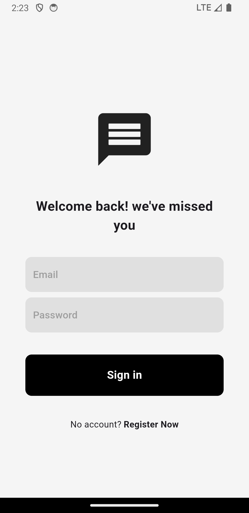
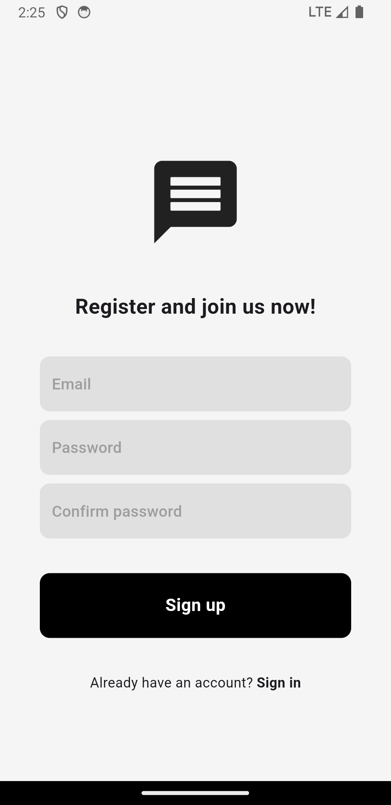
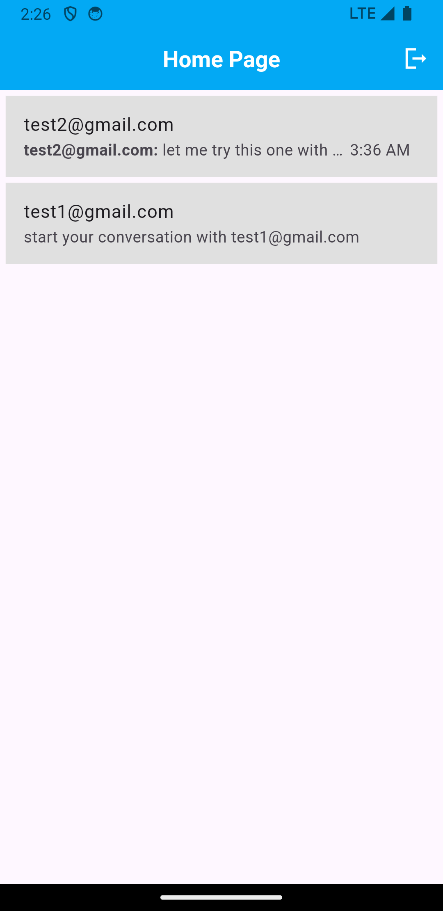
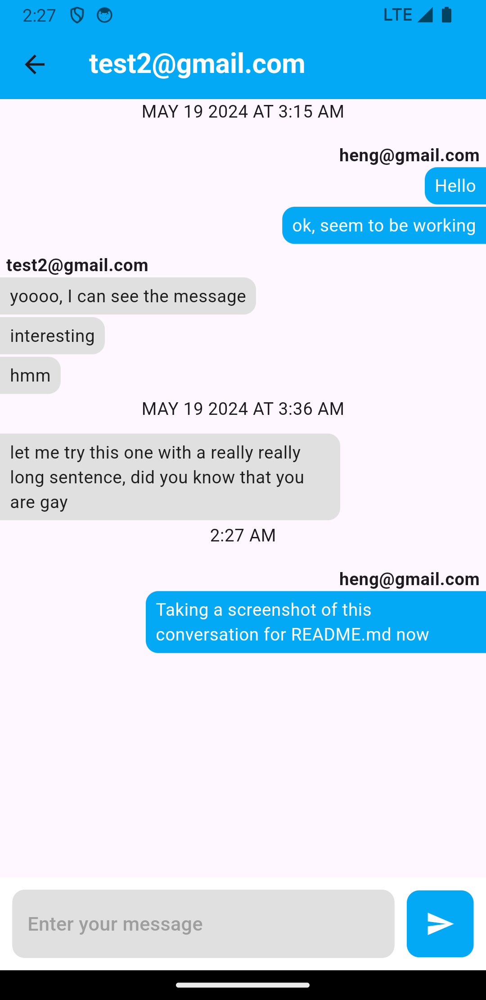

# flutter_messaging_app

This is a simple messaging app made with flutter and firebase.

A quick flutter project written with a video tutorial to make me understand more about flutter. (took me like 3 days to finish the tutorial)

## Table of Contents

1. [The Tutorial Source](#first-heading)
2. [What is in the messaging app?](#second-heading)
3. [Tools used](#third-heading)
4. [How to run this project in your computer?](#fourth-heading)


<a id="first-heading"></a>
## The Tutorial Source

The youtube video tutorial that is used to guide me in making this project.

- [Chat Messenger App • Full Tutorial from scratch / Flutter x Firebase by Mitch Koko](https://youtu.be/mBBycL0EtBQ?si=o6m5PPE7umydazbH)

All you need is flutter and Android Studio or XCode ready and you can follow his tutorial.

<a id="second-heading"></a>
## What is in the messaging app?

the app have four screens or pages only:

1. Sign in Screen

<p align="center">
  
</p>

2. Register/Sign up Screen

<p align="center">
  
</p>

3. Home Screen (only show the user to chat to)

<p align="center">
  
</p>

4. Chat Screen
<p align="center">
  
</p>

Even though I finished the tutorial, the app might look different from the screenshot as I added more stuffs later.

<a id="third-heading"></a>
## Tools used

1. Flutter
   - used for the client app with state management

2. Firebase
   - used for authentication 
   - firestore for storing messages in chat

<a id="fourth-heading"></a>
## How to run this project in your computer?

### 1. install and setup firebase

Here is some command to install Firebase CLI on Windows and Linux (I don't have a macbook yet)
- Install Firebase CLI Tools on Windows with winget
```
winget install -e --id Google.FirebaseCLI
```

- Install Firebase CLI Tools from npm (Node Package Manager) on Linux. You will need to install npm first.
```
npm install firebase-tools
```

Then login to your firebase account
```
firebase login
```
Note: make sure that firebase is in your path and restart your terminal.

Then you need to create a firebase project, setup the authentication and firestore. The video tutorial show you how to do it.
- [Create firebase project + Authentication](https://youtu.be/mBBycL0EtBQ?si=HYPw8uhlne_KQWmA&t=676) (Timestamp: 11:16)
- [Firestore](https://youtu.be/mBBycL0EtBQ?si=Zyfl0wH3yMVyym0l&t=1270) (Timestamp: 21:10)

### 2. Install dependencies and configure project
install the dependencies for the project
```
  flutter pub get
```
```
  dart pub global activate flutterfire_cli
```
make sure to have flutterfire in path and choose your options after runnning the below command
```
  flutterfire configure
```

and the project should be ready to run.